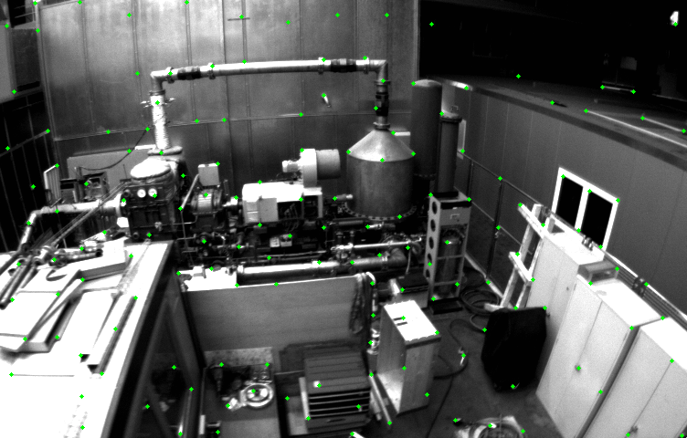
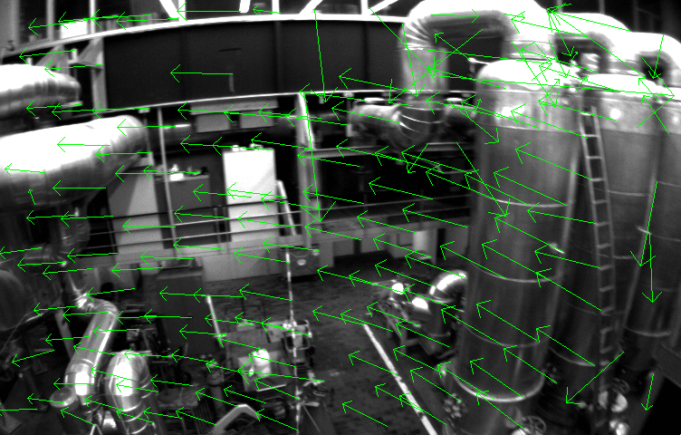

# vio-hello-world-impl

* [Feature Extraction](#feature-extraction)
  + [Harris Features](#harris-features)
  + [ORB Features](#orb-features)
* [Pyramid Optical Flow](#pyramid-optical-flow)
* [Triangulate](#triangulate)
* [Jacobi Evaluate](#jacobi-evaluate)
  + [Numerical Jacobi Evaluate](#numerical-jacobi-evaluate)
  + [Auto Differ Jacobi Evaluate](#auto-differ-jacobi-evaluate)
* [IMU Integration](#imu-integration)
  + [Midpoint Integration](#midpoint-integration)
  + [Euler Integration](#euler-integration)

## Feature Extraction

### Harris Features

| OpenCV                          | Impl                          |
| ------------------------------- | ----------------------------- |
|  |  |

### ORB Features

| OpenCV                          | Impl                                      | ORB-SLAM  Impl |
| ------------------------------- |----------------------------------------------------|----------------------------------------------------|
|  |  |  |

## Pyramid Optical Flow

Implementation of optical flow tracking

## Triangulate

Triangulation via SVD(Singular Value Decomposition).

## Jacobi Evaluate

Jacobi Evaluate

### Numerical Jacobi Evaluate

Numerical Jacobi Evaluate

### Auto Differ Jacobi Evaluate

Auto Differ Jacobi Evaluate

## IMU Integration 

IMU Integration

### Midpoint Integration

Midpoint Integration

### Euler Integration

Euler Integration