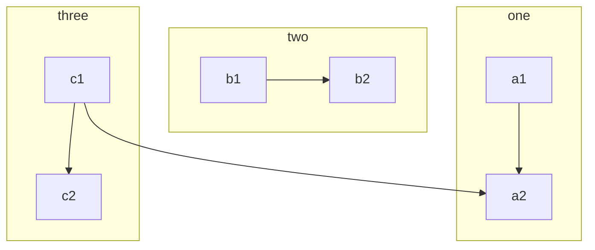

# Mermaid

    ```mermaid
    graph TB
        c1-->a2
        subgraph one
        a1-->a2
        end
        subgraph two
        b1-->b2
        end
        subgraph three
        c1-->c2
        end
    ```



## Optional settings

Theme initialize mermaid with default configuration (`{}`), You can custom config like this:

```yml
mermaid:
  initialize:
    startOnLoad: true
    logLevel: fatal
    flowchart:
      diagramPadding: 8
      htmlLabels: true
      curve: linear
    gantt:
      titleTopMargin: 25
    .
    .
    .
```

```tip
The theme chooses the stable version of mermaid, if you want to use the custom mermaid, add following configuration
```

```yml
mermaid:
  custom: https://cdn.jsdelivr.net/npm/mermaid/dist/mermaid.min.js
```

Mermaid documentation, see: [https://mermaid-js.github.io/mermaid/](https://mermaid-js.github.io/mermaid/)
